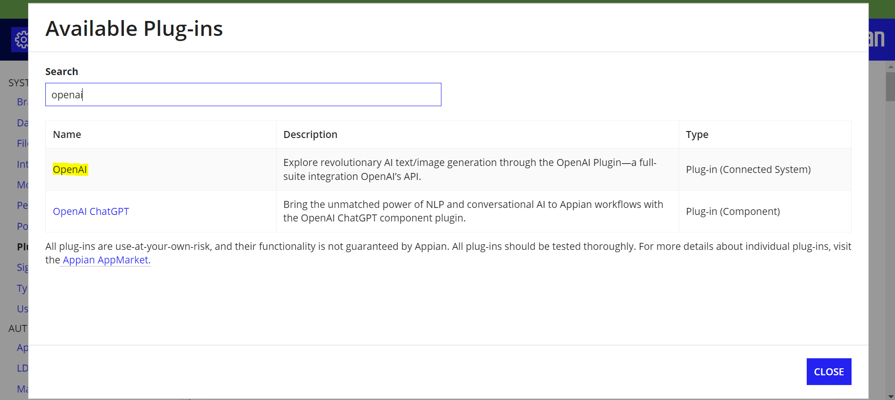
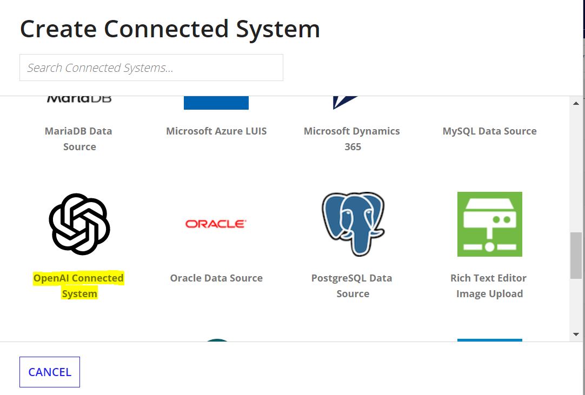
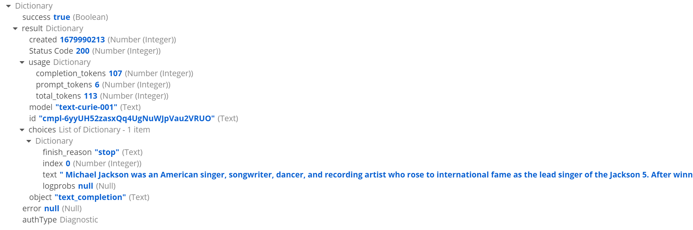

Appian is a low-code automation platform that enables organizations to quickly build, deploy, and scale enterprise-grade applications. On the other hand, ChatGPT is an advanced natural language processing AI model that can understand and generate human-like text.

In this article, we will discuss the steps to integrate Appian with ChatGPT.

Step 1: Create an account in ChatGPT

Open [https://chat.openai.com](https://chat.openai.com/) and signup to create an account.

Step 2: Generate API Key

Open [https://beta.openai.com/account/api-keys](https://beta.openai.com/account/api-keys) , and create a new secret key. Save the generated key.

Step 3: Configure OpenAI Connected System in Appian

Add the plugin (OpenAI) from Appian Admin Console.


Once the plugin is deployed, Create a new connected system, search and select OpenAI connected system.



Enter the API key generated from step 2. The organization field is optional and can be left blank and save the connected System.

Step 4: Create integration.

Create an integration object and select the OpenAI connected system created in step 3.

Select the Operation as "Open AI (Reads Data)" and select the Endpoint.


In the request body, give the below value.

```json
{
  model: "text-curie-001",  
  prompt: "who is michael jackson",  
  max_tokens: 1000, 
}
```

Save the changes and click "Test Request". You would get the response from chatGPT API.



You can play around with different endpoints and different models.

Other models can be found at [https://platform.openai.com/docs/models/gpt-3](https://platform.openai.com/docs/models/gpt-3). I will be using "text-curie-001" model as it is faster and cheaper.
