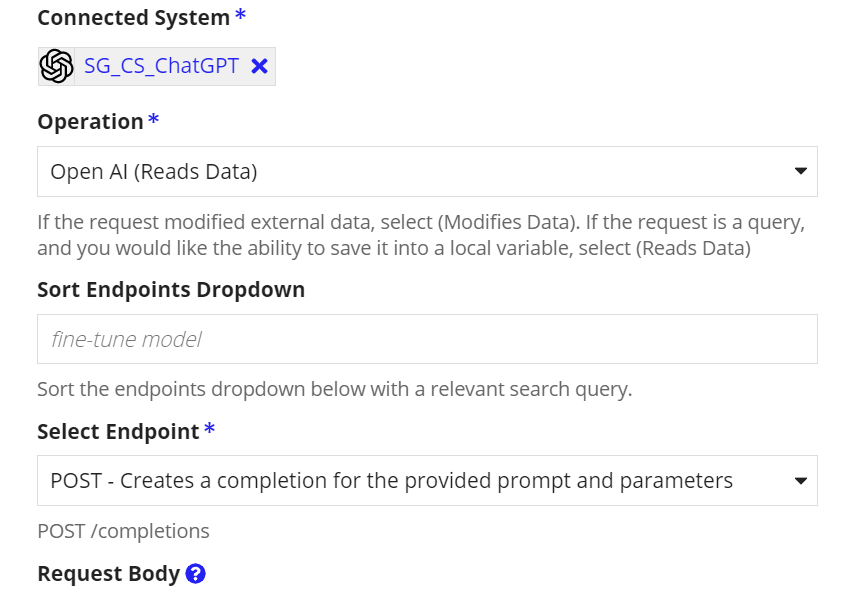
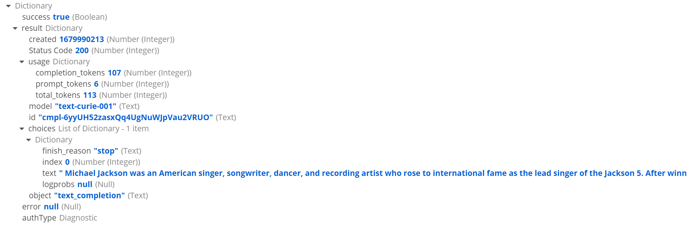

Appian is a low-code automation platform that enables organizations to quickly build, deploy, and scale enterprise-grade applications. ChatGPT is an advanced natural language processing AI model that can understand and generate human-like text.

In this article, we will discuss the steps to integrate Appian with ChatGPT.

## Step 1: Create an Account in ChatGPT

Open [https://chat.openai.com](https://chat.openai.com/) and sign up to create an account.

## Step 2: Generate API Key

Open [https://beta.openai.com/account/api-keys](https://beta.openai.com/account/api-keys) and create a new secret key. Save the generated key.

## Step 3: Configure OpenAI Connected System in Appian

Add the **OpenAI** plugin from the Appian Admin Console.


Once the plugin is deployed, create a new connected system, search for and select **OpenAI connected system**.


Enter the **API key** generated from Step 2. The organization field is optional and can be left blank. Save the connected system.

## Step 4: Create Integration

Create an integration object and select the OpenAI connected system created in Step 3. Select the operation as **Open AI (Reads Data)** and choose the endpoint.



In the request body, provide the following value:

```json
{
  "model": "text-curie-001",
  "prompt": "who is michael jackson",
  "max_tokens": 1000
}
```

Save the changes and click **Test Request**. You should receive a response from the ChatGPT API.



You can experiment with different endpoints and models. Other models can be found at [https://platform.openai.com/docs/models/gpt-3](https://platform.openai.com/docs/models/gpt-3). This example uses the `text-curie-001` model as it is faster and cheaper.
