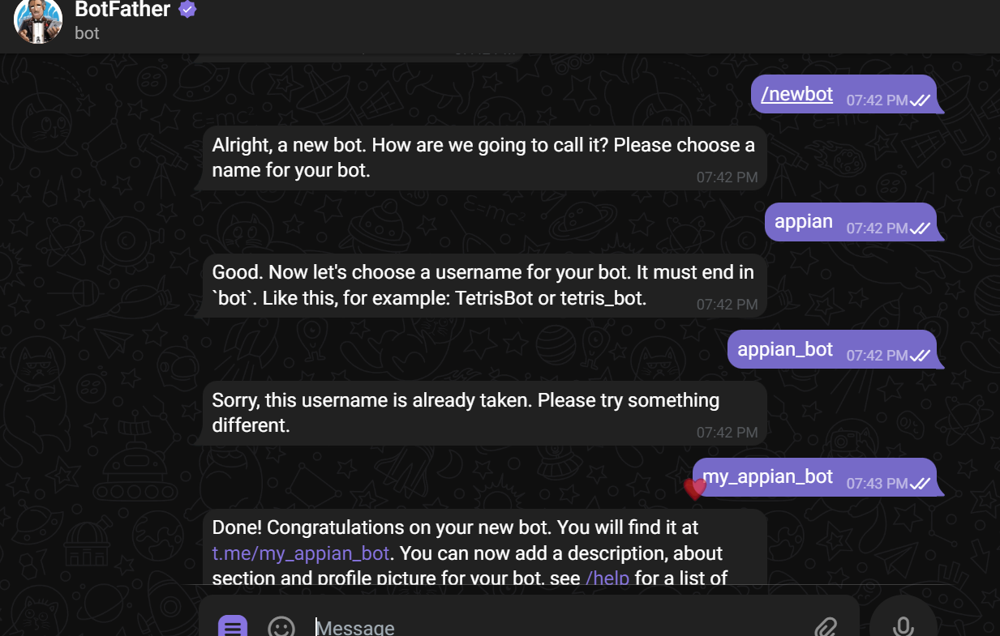
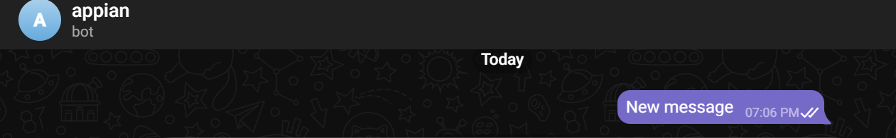
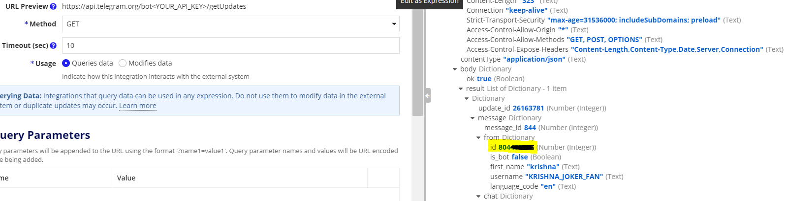
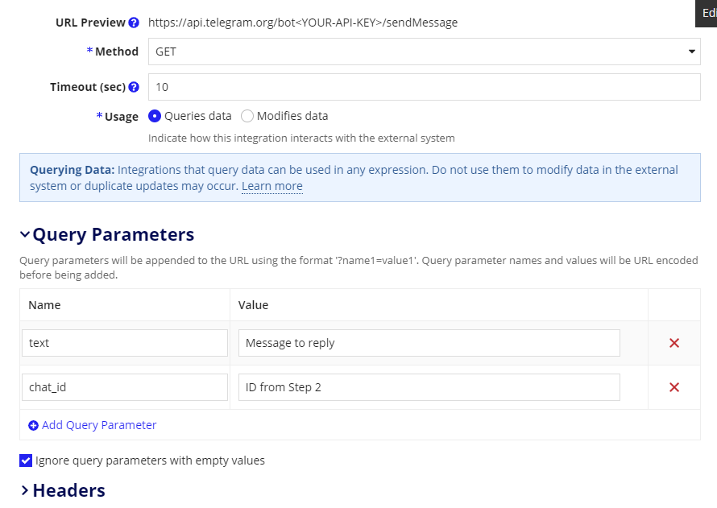
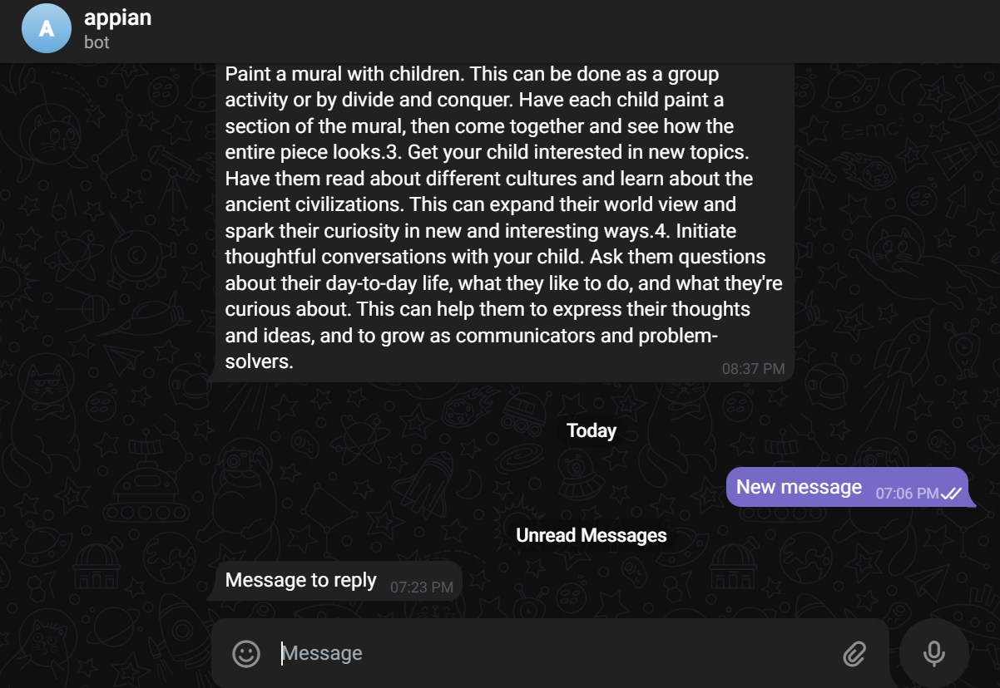

+++
date = '2026-05-31T13:01:30+05:30'
draft = false
title = 'Appian Integration With Telegram'
[cover]
image = 'cover.jpeg'
relative = false
images = ['cover.jpeg']
+++

Telegram is a popular messaging app that offers advanced features such as encryption, file sharing, and bots. Appian is a low-code platform that allows businesses to create custom enterprise applications quickly and efficiently.

In this article, we will discuss the steps to integrate Appian with Telegram.

## Step 1: Create a Telegram Bot

A bot is a special type of account that can send and receive messages automatically. In Telegram, search for **BotFather** and enter `/start` to start the conversation. Enter `/newbot`, give it a name (displayed in the chat), and a username which should end with `bot`.

Once you have created the bot, Telegram will provide you with an **API key**. This key is required to integrate Telegram with Appian.

## Step 2: Get Chat ID

Search for the bot you created above in Telegram and send it a message.

Create an Appian Integration object with the following values:

- **URL input**: `https://api.telegram.org/bot<your-bot-API-key>/getUpdates`
- **Method**: `GET`

Test the integration. Save the highlighted `id` from the response — this is the **chat ID**, used to send messages.

## Step 3: Send a Message

Create another integration object with the following values:

- **URL input**: `https://api.telegram.org/bot<your-bot-API-key>/sendMessage`
- **Method**: `GET`

**Query Parameters:**

| Parameter  | Value            |
| ---------- | ---------------- |
| `text`     | "Message to send" |
| `chat_id`  | ID from Step 2   |

If the integration is working correctly, the message should be received in Telegram.

Once the integration is complete, you can use it to receive notifications and send messages directly from Appian to Telegram.

In conclusion, integrating Appian with Telegram is a simple and effective way to improve communication and collaboration within your organization.
